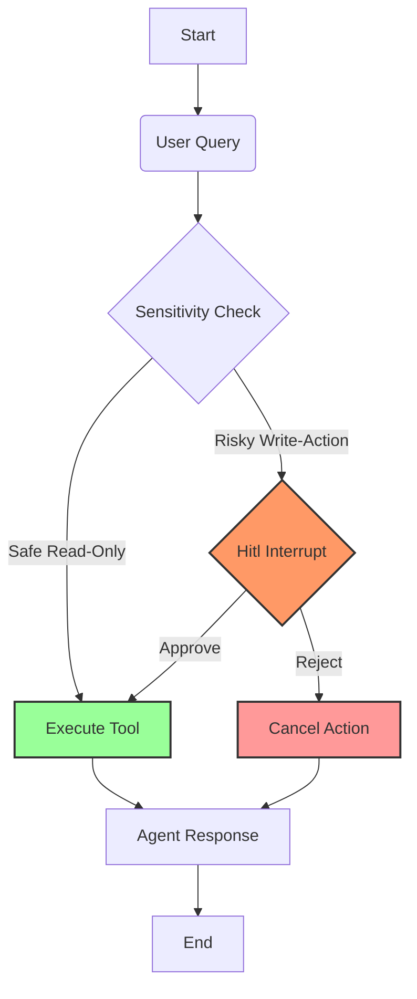

# Human-in-the-Loop (HITL) AI Agent Demo

A comprehensive demonstration of **Human-in-the-Loop** workflows in AI Agents using `LangGraph` and `Streamlit`. This repository showcases how to build agents that can autonomously execute tasks while intelligently pausing for human approval when dealing with sensitive actions (like financial transactions).

## 🚀 Overview

This dashboard includes three distinct demos:

### 1. **Demo 1: The Concept (Tutorial)**
A visual, step-by-step walkthrough of the HITL logic.
- **Flow**: User Query → Agent Request → **Human Permission (Interrupt)** → Model Action.
- **Goal**: To educate users on the "Interrupt" mechanism in agentic workflows.
- **Visualization**: Uses a dynamic flowchart to highlight the active state (Wait vs. Success vs. Deny).

### 2. **Demo 2: Fully Autonomous Agent**
A "Risky" Stock Broker Agent that has no safety checks.
- **Tools**: `get_stock_price`, `purchase_stock`.
- **Behavior**: If you ask it to "Buy 100 shares of AAPL", it will execute the purchase **immediately** without confirmation.
- **Tech**: Standard `LangGraph` execution.

### 3. **Demo 3: Human-in-the-Loop Agent**
A "Safe" Stock Broker Agent.
- **Tools**: `get_stock_price`, `purchase_stock`.
- **Behavior**: Uses `interrupt()` from `langgraph.types`.
- **Flow**:
    1. Agent receives "Buy" command.
    2. Agent calls `purchase_stock` tool.
    3. **Tool Interrupts**: Logic pauses execution and raises a flag.
    4. **UI**: Shows "Approve" / "Reject" buttons.
    5. **Resume**:
        - **Approve**: Tool executes logic → Agent confirms.
        - **Reject**: Tool returns "Cancelled" → Agent apologizes.

---

## 🛠️ Setup & Installation

### Prerequisites
- Python 3.10+
- OpenAI API Key

### 1. Clone the Repository
```bash
git clone https://github.com/ashumishra2104/Human_in_the_loop_demo.git
cd Human_in_the_loop_demo
```

### 2. Install Dependencies
```bash
python3 -m venv venv
source venv/bin/activate
pip install -r requirements.txt
```

### 3. Configure Environment
Create a `.env` file in the root directory:
```env
OPENAI_API_KEY=sk-your_api_key_here
```

### 4. Run the Application
```bash
streamlit run app.py
```
Visit `http://localhost:8501` in your browser.

---


---

## � Workflow Diagram



## �📂 Project Structure


- `app.py`: **Main Entry Point**. The Streamlit dashboard that routes between the 3 demos.
- `chatbot_without_hitl.py`: Backend logic for the Autonomous Agent (Demo 2).
- `chatbot_with_hitl.py`: Backend logic for the HITL Agent (Demo 3) using `interrupt`.
- `streamlit_hitl.py` / `streamlit_hitl_basic.py`: Logic for the visual tutorial (Demo 1).
- `requirements.txt`: Python dependencies.

---

## 🧠 tech Stack

- **Framework**: [LangGraph](https://langchain-ai.github.io/langgraph/) (Stateful orchestration)
- **LLM**: OpenAI (GPT-4o/mini)
- **UI**: Streamlit
- **Visualization**: Graphviz

---

## 📄 License
MIT License. See `LICENSE` for details.
